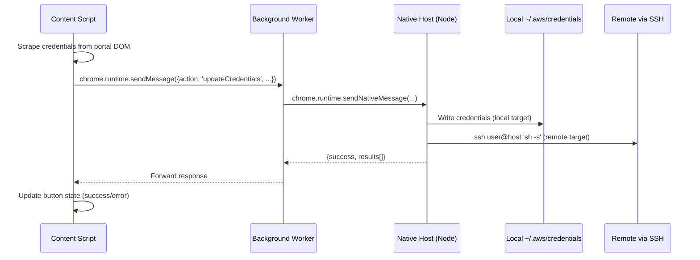

# AWS Account Label Helper

A Microsoft Edge browser extension that labels AWS account license plates with friendly product names on the BC Gov AWS SSO portal — and optionally syncs short-lived access keys to local and remote machines.

## Features

- **Automatic Labeling** — Displays product names next to AWS account license plates (e.g., `b0ec6c-dev` shows "BC Parks Data Register")
- **Customizable Mappings** — Add, edit, and delete license plate mappings through the popup UI
- **Real-time Updates** — Labels update automatically when mappings change
- **Persistent Storage** — Mappings sync across sessions via `chrome.storage.sync`
- **Access Keys Sync (optional)** — One-click credential push from the SSO portal to `~/.aws/credentials` on localhost and/or remote machines over SSH. Disabled by default; the core labeling feature works without it.

## Quick Install

**Latest Release**: [Download from GitHub Releases](https://github.com/digitalspace/bcgov-access-portal/releases/latest)

1. Download the `.zip` from the Assets section
2. Extract the ZIP to a folder
3. Open Edge → `edge://extensions/` → enable **Developer mode**
4. Click **Load unpacked** and select the extracted folder

## Usage

### Viewing Labels

Navigate to `https://bcgov.awsapps.com/start/#/?tab=accounts` — labels appear automatically next to recognized license plates.

### Managing Mappings

1. Click the extension icon in the toolbar
2. Add a mapping: enter a license plate code (e.g., `b0ec6c`) and a product name, then click **Add**
3. Delete a mapping with the **x** button
4. Changes apply immediately to any open AWS portal tabs

## Access Keys Sync (Optional)

### Why

AWS SSO credentials rotate frequently. Copying them manually from the portal into `~/.aws/credentials` on every machine you work on is tedious and error-prone. Access Keys Sync automates this: one click on the portal pushes credentials to all your configured targets.

### Prerequisites

- **Node.js** — the native messaging host (`native-host/host.js`) runs as a Node process
- **SSH client + key-based auth** — required only for remote (SSH) targets

### Setup

1. Run the installer from the extension directory:

   ```sh
   cd native-host && bash install.sh
   ```

   The script will ask for your extension ID (find it at `edge://extensions/`). It registers the native messaging host manifest in all detected Chromium browser config directories.

2. Open the extension popup and enable **Access Keys Sync**.
3. Add one or more credential targets:
   - **Local** — writes to a path on the machine running the browser (default `~/.aws/credentials`)
   - **SSH** — writes to a path on a remote machine via `ssh user@host`

### Usage

On the AWS SSO portal, each labeled account shows an **Update Access Keys** button. Clicking it:

1. Expands the account (if collapsed)
2. Opens the "Access keys" dialog
3. Reads the credentials from Option 2
4. Closes the dialog
5. Sends the credentials through the native messaging host to all configured targets

The button shows real-time status: loading → success/error with a count of updated targets.

### Message Flow



## Default Mappings

The extension ships with these pre-configured mappings:

| Code | Product |
|------|---------|
| `b0ec6c` | BC Parks Data Register |
| `b74067` | BC Parks Backcountry Reservations |
| `fac0b6` | BC Parks Attendance and Revenue Reporting |
| `fad511` | Day Use Pass Reservations |
| `pil3ei` | Day Use Pass Reservations |

## File Structure

```
bcgov-access-portal/
├── manifest.json                           # Extension manifest (MV3)
├── content.js                              # Content script — labeling + credential scraping
├── background.js                           # Service worker — bridges content script ↔ native host
├── popup.html                              # Popup UI
├── popup.js                                # Popup logic (mappings + access keys config)
├── styles.css                              # Injected label + button styles
├── mapping.json                            # Default license plate → product name mappings
├── icons/                                  # Extension icons
├── native-host/
│   ├── install.sh                          # Registers native messaging host with the browser
│   ├── host.js                             # Native messaging host (Node) — writes credentials
│   └── com.bcgov.aws_credential_helper.json  # Manifest template
└── .github/workflows/release.yml           # CI: auto-bump version + GitHub Release
```

## Technical Details

- **Manifest Version**: 3
- **Permissions**: `storage`, `activeTab`, `nativeMessaging`, `tabs`
- **Content Script**: Runs on `https://bcgov.awsapps.com/start/*` at `document_idle`
- **Native Messaging Host**: `com.bcgov.aws_credential_helper` — Node.js process using stdio protocol
- **Storage Keys**: `licensePlateMappings`, `accessKeysEnabled`, `credentialTargets`

## Troubleshooting

- **Labels not appearing** — Refresh the AWS portal page after installing/reloading the extension
- **"Native host not detected" warning** — Run `native-host/install.sh` and make sure the extension ID matches
- **SSH target failing** — Verify key-based auth works: `ssh user@host echo ok`
- **Credentials not updating** — Check that Node.js is installed and `native-host/host.js` is executable

## License

This extension is for internal BC Gov use.
